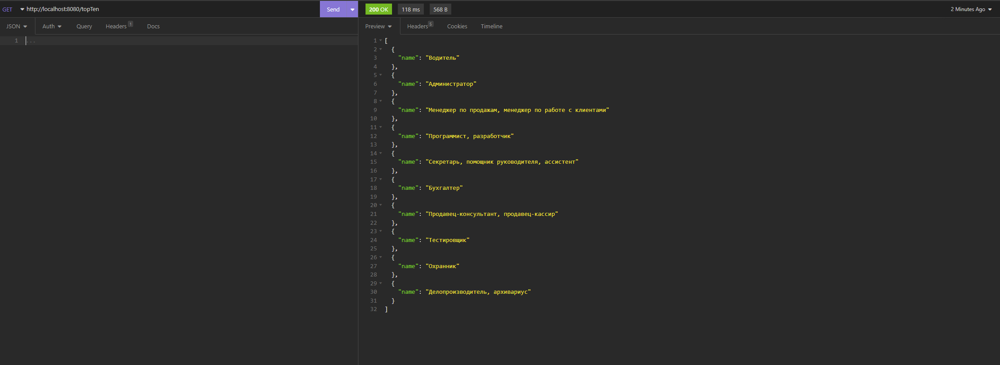
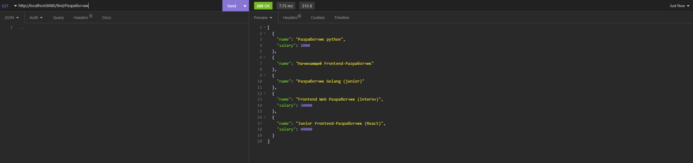

# Kora
Бекенд приложение на [kora](https://tinkoff.github.io/kora/examples/hello-world/).  
Каждый день в 21:45 собирается информация о текущих вакансиях с сайта **HH.ru**

```java
    @ScheduleWithCron(value = "0 45 21 ? * *")
    public void reloadVacancies() 
```

**Можно посмотреть самые популярные профессии** 



**Либо найти нужные вакансии**




### [kora](kora)
- [repositories](kora/src/main/java/org/example/repositories) 
    - VacanciesRepository

- [services](kora/src/main/java/org/example/service)
    - VacancyService


- [contollers](kora/src/main/java/org/example/controllers)
    - HeadHunterController

- [httpClient](kora/src/main/java/org/example/httpClient) 
    - clientHeadHunter

- [httpClient](kora/src/main/java/org/example/dto)
  - ResponseHH
  - ResponseVacancy